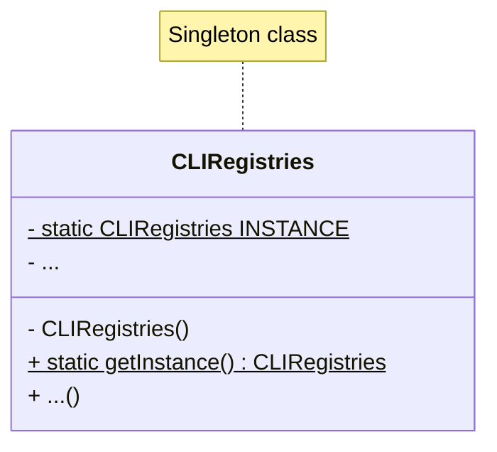
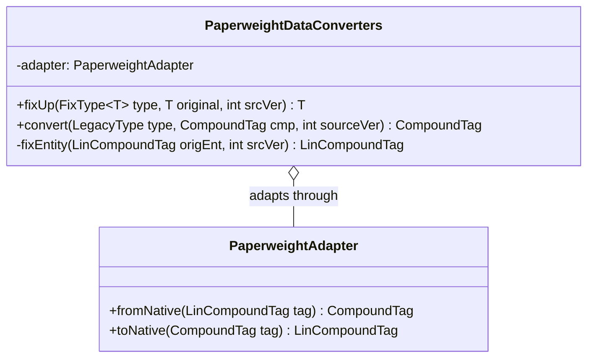
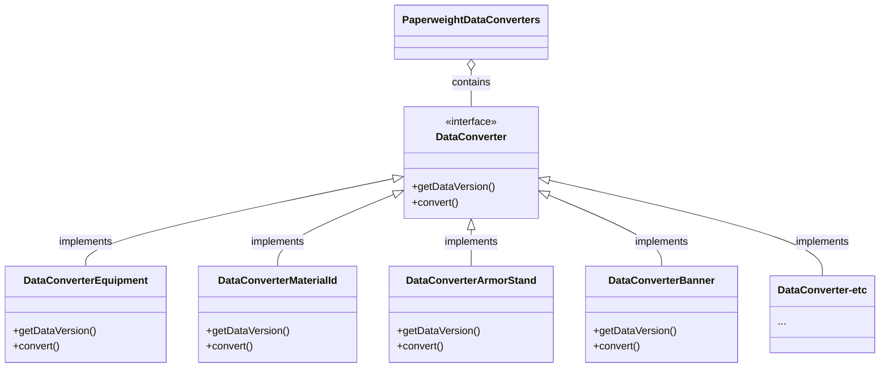

# 1. Singleton pattern

## Code snippet

In `worldedit-cli/src/main/java/com/sk89q/worldedit/cli/CLIRegistries.java`:

```java
public class CLIRegistries extends BundledRegistries {

    private static final CLIRegistries INSTANCE = new CLIRegistries();
    
    // ...

    private CLIRegistries() {
    }

    public static CLIRegistries getInstance() {
        return INSTANCE;
    }
    // ...
}
```

## Class diagram



## Code location

- **Package:** `com.sk89q.worldedit.cli`
- **Class:** `CLIRegistries`

## Rationale

This is a classic Singleton pattern with a private constructor and a single private static final `INSTANCE` that can be accessed through a public global access point `getInstance()`. This reduces possible memory overhead by avoiding duplicate instances and ensures that registry configurations are globally consistent application-wide.


# 2. Adapter pattern

## Code snippet

In `worldedit-bukkit/adapters/adapter-1.20.2/src/main/java/com/sk89q/worldedit/bukkit/adapter/impl/v1_20_R2/PaperweightDataConverters.java`:

```java
class PaperweightDataConverters extends DataFixerBuilder implements com.sk89q.worldedit.world.DataFixer {
    // ...

    public <T> T fixUp(FixType<T> type, T original, int srcVer) {
        //...
        } else if (type == FixTypes.ENTITY) {
            return (T) fixEntity((LinCompoundTag) original, srcVer);
    // ...
    }

    private LinCompoundTag fixEntity(LinCompoundTag origEnt, int srcVer) {
        CompoundTag tag = (CompoundTag) adapter.fromNative(origEnt);
        CompoundTag fixed = convert(LegacyType.ENTITY, tag, srcVer);
        return (LinCompoundTag) adapter.toNative(fixed);
    }

    public static CompoundTag convert(LegacyType type, CompoundTag cmp, int sourceVer) {
        return convert(type.getDFUType(), cmp, sourceVer);
    }

    // ...

    private final PaperweightAdapter adapter;
```

## Class diagram



## Code location

- **Package:** `com.sk89q.worldedit.bukkit.adapter.impl.v1_20_R2`
- **Class:** `PaperweightDataConverters`

## Rationale

The `PaperweightAdapter` class is used to adapt between `LinCompoundTag` and `CompoundTag` and allow compatibility with the Minecraft data format. The methods 'fromNative' and 'toNative' allow `PaperweightDataConverters` to apply `convert` to `LinCompoundTag` objects instead of the `CompoundTag` objects that the method expects.

# 3. Strategy pattern

## Code snippet

In `worldedit-bukkit/adapters/adapter-1.20.2/src/main/java/com/sk89q/worldedit/bukkit/adapter/impl/v1_20_R2/PaperweightDataConverters.java`:

```java
public interface DataConverter {

  int getDataVersion();

  CompoundTag convert(CompoundTag cmp);
}

private static class DataConverterEquipment implements DataConverter {
  // ...
}

private static class DataConverterMaterialId implements DataConverter {
  // ...
}

private static class DataConverterArmorStand implements DataConverter {
  // ...
}

private static class DataConverterBanner implements DataConverter {
  // ...
}

// ...
```
## Class diagram



## Code location

- **Package:** `com.sk89q.worldedit.bukkit.adapter.impl.v1_20_R2`
- **Class:** `PaperweightDataConverters`

## Rationale

The `DataConverter` strategy interface is implemented by different concrete data converters (`DataConverterEquipment`, `DataConverterMaterialId`, etc.) that encapsulate specific conversion behaviors according to the type of data being received (`Equipment`, `MaterialID`, etc.). This allows `PaperweightDataConverters` to apply the appropriate conversion strategy depending on the type of data, while also allowing further extensions without needing to modify existing code (the Open/Closed principle).
