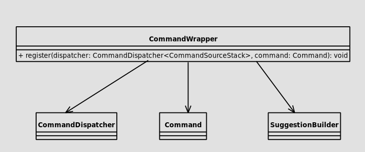
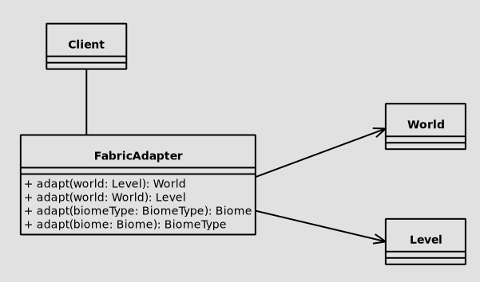
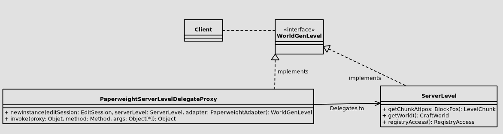

# 1. FACADE PATTERN

## Code Snippet

```java

public final class CommandWrapper {

    private CommandWrapper() {
    }

    public static void register(CommandDispatcher<CommandSourceStack> dispatcher, org.enginehub.piston.Command command) {
        ImmutableList.Builder<String> aliases = ImmutableList.builder();
        aliases.add(command.getName()).addAll(command.getAliases());

        Command<CommandSourceStack> commandRunner = ctx -> {
            WorldEdit.getInstance().getEventBus().post(new com.sk89q.worldedit.event.platform.CommandEvent(
                adaptCommandSource(ctx.getSource()),
                "/" + ctx.getInput()
            ));
            return 0;
        };

        for (String alias : aliases.build()) {
            LiteralArgumentBuilder<CommandSourceStack> base = literal(alias).executes(commandRunner)
                    .then(argument("args", StringArgumentType.greedyString())
                            .suggests(CommandWrapper::suggest)
                            .executes(commandRunner));
            if (command.getCondition() != org.enginehub.piston.Command.Condition.TRUE) {
                base.requires(requirementsFor(command));
            }
            dispatcher.register(base);
        }
    }
    
    //
}

```

## Class Diagram



## Codebase Location
`worldedit-fabric/src/main/java/com/sk89q/worldedit/fabric/CommandWrapper.java`
- ***Package***: com.sk89q.worldedit.fabric
- ***Class***: CommandWrapper

## Rationale
- By providing a single method (`register`) for command registration, the class separates these concerns from the rest of the application.
- Users do not need to deal with the specifics of `CommandDispatcher`, `Command`, or `CommandSyntaxException`. The class hides these details.


# 2. ADAPTER PATTERN

## Code Snippet

```java
 public final class FabricAdapter {
    
    //

    public static World adapt(net.minecraft.world.level.Level world) {
        return new FabricWorld(world);
    }

    /**
     * Create a Fabric world from a WorldEdit world.
     *
     * @param world the WorldEdit world
     * @return a Fabric world
     */
    public static net.minecraft.world.level.Level adapt(World world) {
        checkNotNull(world);
        if (world instanceof FabricWorld) {
            return ((FabricWorld) world).getWorld();
        } else {
            // TODO introduce a better cross-platform world API to match more easily
            throw new UnsupportedOperationException("Cannot adapt from a " + world.getClass());
        }
    }

    public static Biome adapt(BiomeType biomeType) {
        return FabricWorldEdit.getRegistry(Registries.BIOME)
                .get(ResourceLocation.parse(biomeType.id()));
    }

    public static BiomeType adapt(Biome biome) {
        ResourceLocation id = FabricWorldEdit.getRegistry(Registries.BIOME).getKey(biome);
        Objects.requireNonNull(id, "biome is not registered");
        return BiomeTypes.get(id.toString());
    }
    
    //
}

```

## Class Diagram



## Codebase Location
`worldedit-fabric/src/main/java/com/sk89q/worldedit/fabric/FabricAdapter.java`
- ***Package***: com.sk89q.worldedit.fabric
- ***Class***: FabricAdapter


## Rationale
- Methods like `adapt(net.minecraft.world.level.Level world)`, `adapt(World world)`, `adapt(BiomeType biomeType)`, `adapt(Biome biome)` and others, convert objects from one type to another.
- eg. `adapt(Biome biome)` and `adapt(BiomeType biomeType)` convert from Biome to BiomeType and vice versa respectively.
- eg. `adapt(net.minecraft.world.level.Level world)` and `aadapt(World world)` convert from Level to World and vice versa respectively.
- The class ensures that the rest of the application can use these conversions without worrying about the details of how the adaptation is performed.


# 3. (Virtual) PROXY PATTERN

## Code Snippet

```java
public class PaperweightServerLevelDelegateProxy implements InvocationHandler {
    
    private final EditSession editSession;
    private final ServerLevel serverLevel;
    private final PaperweightAdapter adapter;

    private PaperweightServerLevelDelegateProxy(EditSession editSession, ServerLevel serverLevel, PaperweightAdapter adapter) {
        this.editSession = editSession;
        this.serverLevel = serverLevel;
        this.adapter = adapter;
    }
    
    public static WorldGenLevel newInstance(EditSession editSession, ServerLevel serverLevel, PaperweightAdapter adapter) {
        return (WorldGenLevel) Proxy.newProxyInstance(
                serverLevel.getClass().getClassLoader(),
                serverLevel.getClass().getInterfaces(),
                new PaperweightServerLevelDelegateProxy(editSession, serverLevel, adapter)
        );
    }
    
    //

    public Object invoke(Object proxy, Method method, Object[] args) throws Throwable {
        switch (method.getName()) {
            case "a_", "getBlockState", "addFreshEntityWithPassengers" -> {
                if (args.length == 1 && args[0] instanceof BlockPos blockPos) {
                    // getBlockState
                    return getBlockState(blockPos);
                } else if (args.length >= 1 && args[0] instanceof Entity entity) {
                    // addFreshEntityWithPassengers
                    return addEntity(entity);
                }
            }
            case "c_", "getBlockEntity" -> {
                if (args.length == 1 && args[0] instanceof BlockPos blockPos) {
                    // getBlockEntity
                    return getBlockEntity(blockPos);
                }
            }
            case "a", "setBlock", "removeBlock", "destroyBlock" -> {
                if (args.length >= 2 && args[0] instanceof BlockPos blockPos && args[1] instanceof BlockState blockState) {
                    // setBlock
                    return setBlock(blockPos, blockState);
                } else if (args.length >= 2 && args[0] instanceof BlockPos blockPos && args[1] instanceof Boolean bl) {
                    // removeBlock (and also matches destroyBlock)
                    return removeBlock(blockPos, bl);
                }
            }
            case "j", "addEntity" -> {
                if (args.length >= 1 && args[0] instanceof Entity entity) {
                    return addEntity(entity);
                }
            }
            default -> { }
        }

        return method.invoke(this.serverLevel, args);
    }
    
}
```

## Class Diagram


This diagram does not fully explain the situation. This class implements `InvocationHalder` and overrides its method `invoke`.
By using `serverLevel.getClass().getInterfaces()`, it is then able to implement whatever interface `serverLevel` class implements (in this case `WorldGenLevel`).
When a method is called on the proxy instance, this method intercepts the call. It then delegates to the actual ServerLevel instance.

## Codebase Location
`worldedit-bukkit/adapters/adapter-1.20.2/src/main/java/com/sk89q/worldedit/bukkit/adapter/impl/v1_20_R2/PaperweightServerLevelDelegateProxy.java`
- ***Package***: com.sk89q.worldedit.bukkit.adapter.impl.v1_20_R2
- ***Class***: PaperweightServerLevelDelegateProxy

## Rationale
- The `newInstance` method creates a new proxy instance of WorldGenLevel.
- The `invoke` method intercepts calls to methods on the proxied ServerLevel object (which implements WorldGenLevel). It checks the method name and parameters to determine what specific action to take.