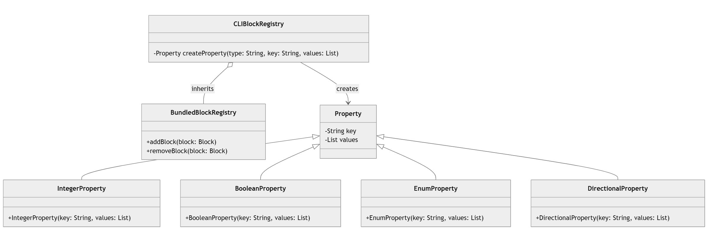
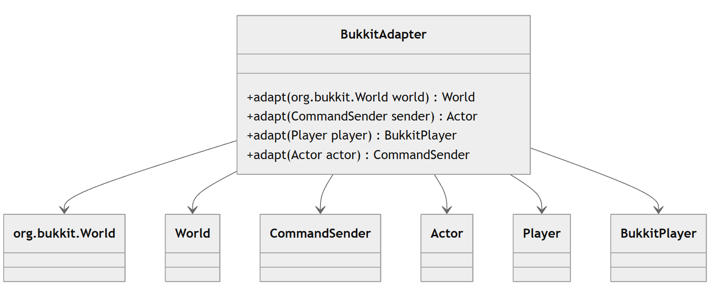

# 1. Factory Pattern

## Code location
`src/main/java/com/sk89q/worldedit/cli/CLIBlockRegistry.java`
- Package: com.sk89q.worldedit.cli
- Class: CLIBlockRegistry
- Method: createProperty

## Code snippet
````java
public class CLIBlockRegistry extends BundledBlockRegistry {

    private Property<?> createProperty(String type, String key, List<String> values) {
        return switch (type) {
            case "int" -> new IntegerProperty(key, values.stream().map(Integer::parseInt).toList());
            case "bool" -> new BooleanProperty(key, values.stream().map(Boolean::parseBoolean).toList());
            case "enum" -> new EnumProperty(key, values);
            case "direction" ->
                new DirectionalProperty(key, values.stream().map(String::toUpperCase).map(Direction::valueOf).toList());
            default -> throw new RuntimeException("Failed to create property");
        };
    }
````
## Class Diagram



## Rationale
- The CLIBlockRegistry class uses the createProperty method to create objects of type Property (IntegerProperty, BooleanProperty, EnumProperty, DirectionalProperty) based on the type parameter.
- This implementation is an example of the Factory Method Pattern, where the createProperty method acts as a factory for different types of properties, deciding which specific class to instantiate according to the data type (int, bool, enum, direction).
- This pattern facilitates the creation of different types of Property without exposing the construction logic outside the createProperty method. This pattern makes the code more flexible and extensible, allowing new property types to be added easily if needed by modifying only the creation method.


# 2. Strategy Pattern

## Code location
`worldedit-fabric/src/main/java/com/sk89q/worldedit/fabric/FabricDataFixer.java`
- Package: com.sk89q.worldedit.fabric
- Class: FabricDataFixer
- Methods: fixUp, fixChunk, fixBlockEntity, fixEntity, fixBlockState, fixItemType, fixBiome

## Code snippet
````java
    public <T> T fixUp(FixType<T> type, T original, int srcVer) {
        if (type == FixTypes.CHUNK) {
            return (T) fixChunk((LinCompoundTag) original, srcVer);
        } else if (type == FixTypes.BLOCK_ENTITY) {
            return (T) fixBlockEntity((LinCompoundTag) original, srcVer);
        } else if (type == FixTypes.ENTITY) {
            return (T) fixEntity((LinCompoundTag) original, srcVer);
        } else if (type == FixTypes.BLOCK_STATE) {
            return (T) fixBlockState((String) original, srcVer);
        } else if (type == FixTypes.ITEM_TYPE) {
            return (T) fixItemType((String) original, srcVer);
        } else if (type == FixTypes.BIOME) {
            return (T) fixBiome((String) original, srcVer);
        }
        return original;
    }
````
## Class diagram
````mermaid

````
## Rationale
- The FabricDataFixer class implements the fixUp method, which applies different correction strategies based on the data type FixType.
- This method directs the application of a specific correction strategy, such as fixChunk, fixBlockEntity, fixEntity, etc., depending on the data type, indicating a Strategy Pattern approach.
- The Strategy Pattern here allows the fixUp method to delegate correction logic to specific methods according to the provided data type.
- Each correction method (fixChunk, fixBlockEntity, etc.) is a strategy for a specific data type.
- This makes the code modular and facilitates adding new correction methods if needed.


# 3. Adapter Pattern

## Code location
`worldedit-bukkit/src/main/java/com/sk89q/worldedit/bukkit/BukkitAdapter.java`
- Package: com.sk89q.worldedit.bukkit
- Class: BukkitAdapter
- Method: adapt

## Code snippet
````mermaid
    public static World adapt(org.bukkit.World world) {
        checkNotNull(world);
        return new BukkitWorld(world);
    }

    // ...
    public static Actor adapt(CommandSender sender) {
        return WorldEditPlugin.getInstance().wrapCommandSender(sender);
    }

    // ...
    public static BukkitPlayer adapt(Player player) {
        return WorldEditPlugin.getInstance().wrapPlayer(player);
    }

    // ...
    public static CommandSender adapt(Actor actor) {
        if (actor instanceof com.sk89q.worldedit.entity.Player) {
            return adapt((com.sk89q.worldedit.entity.Player) actor);
        } else if (actor instanceof BukkitBlockCommandSender) {
            return ((BukkitBlockCommandSender) actor).getSender();
        }
        return ((BukkitCommandSender) actor).getSender();
    }
````
## Class diagram

## Rationale
- The adapt method converts a Location object from Bukkit to a Location object compatible with WorldEdit.
- The Adapter Pattern is useful here because it encapsulates all conversion logic between the two Location types.
- This allows code that relies on WorldEdit's Location to directly use location data from Bukkit without needing to handle conversion details.