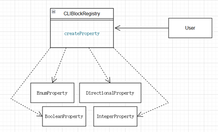
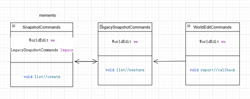
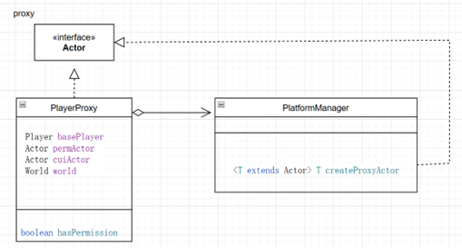

# Design patterns

# 1.Facade

**Code location:** worldedit-cli/src/main/java/com.sk89q/schematic/CLIBockRegistry

Instead of calling the object directly using get, the User uses facade method createproperty() to call then.

**Code:**

```
private createProperty() {
    return switch (type) {
        case "int" -> new IntegerProperty( );
        case "bool" -> new BooleanProperty( );
        case "enum" -> new EnumProperty();
        case "direction" ->
            new DirectionalProperty().map(Direction::valueOf).toList());
        …}
rection" ->
new DirectionalProperty().map(Direction::valueOf).toList());
…}
```



# 2.Memento

**Code location:** worldedit-core/src/main/java/wordedit/command/util, class Snapshotcommands,LegacySnapshotCommands and worldEditCommands.

In the Snapshotcommands the method list lists the statesif it’s empty, creates, then in the LegacySnapshotCommands (the memento class), the method list restores the state. Finally the worldEditCommands class uses the method report to callback. Which meets the characteristics of memento.

**Code:**

```
// LegacySnapshotcommands class:
void restore(Actor actor, World world, LocalSession session, EditSession editSession,
String snapshotName) throws WorldEditException {
…
// Restore snapshot
SnapshotRestore restore = new SnapshotRestore(chunkStore, editSession, region);
restore.restore();
…
// Snapshotcommands class
void list(Actor actor, World world,  @ArgFlag(name = 'p', desc = "Page of results to return", def = "1" int page) throws WorldEditException, IOException {
…
if (!snapshots.isEmpty()) {
actor.print(new SnapshotListBox(world.getName(), snapshots).create(page));
} else {…}
…
}
// worldEditCommands
public void report(Actor actor, @Switch(name = 'p', desc = "Pastebins the report")  boolean pastebin) throws WorldEditException {
…
ActorCallbackPaste.pastebin(we.getSupervisor(), actor, result, metadata, TranslatableComponent.builder("worldedit.report.callback"));
…}
```




# 3.Proxy

**Code location:**  worldedit-coresrc/main/worldedit/extension/platform, Playerp
Proxy class and interface Actor

The playerproxy class is substituting the player object and controls the access of player with the platform manager.

**Code:**

```
//interface Actor
public interface Actor extends Identifiable, SessionOwner, Subject {
String getName();
default String getDisplayName() {return getName();}
…
boolean canDestroyBedrock();
boolean isPlayer()
…
}

//class PlayerProxy
class PlayerProxy extends AbstractPlayerActor {
private final Player basePlayer;
private final Actor permActor;
private final Actor cuiActor;
private final World world;
public boolean hasPermission(String perm) { return permActor.hasPermission(perm);}
…}

//class PlatformManager:
public <T extends Actor> T createProxyActor(T base) {…
return (T) new PlayerProxy(player, permActor, cuiActor, getWorldForEditing(player.getWorld()));
}
```



