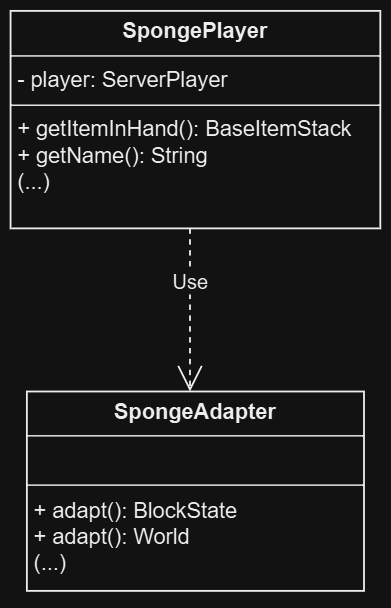
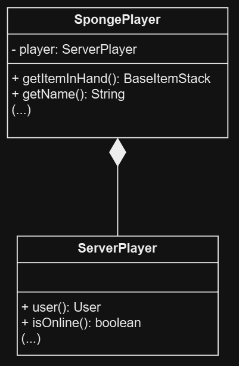
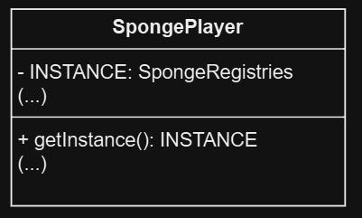

# Adapter


## Code snippet

- **Location** `Worldedit-sponge/src/main/java/com/sk89q.worldedit.sponge/SpongePlayer.java`
- **Package** `com.sk89q.worldedit.sponge`
- **Class** `SpongePlayer`

````java
public Location getLocation() {
        ServerLocation entityLoc = this.player.serverLocation();
        Vector3d entityRot = this.player.rotation();

        return SpongeAdapter.adapt(entityLoc, entityRot);
    }
````

## Class diagram




## Rationale for identifying this as a pattern instance

Many methods in this code transform objects from one type to another, 
showcasing the Adapter pattern. 

- `SpongeAdapter` acts as a bridge, allowing classes using Sponge API 
objects to work with data from an internal API, despite structural differences.
- Without `SpongeAdapter`, classes like `SpongePlayer` would need to handle the 
internal API's data directly, creating tighter coupling and making future changes harder to manage.

# Facade

Structural design pattern that provides a simplified interface to a
library, a framework, or any other complex set of classes.

## Code snippet

- **Location** `Worldedit-sponge/src/main/java/com/sk89q.worldedit.sponge/SpongePlayer.java`
- **Package** `com.sk89q.worldedit.sponge`
- **Class** `SpongePlayer`

````java
public class SpongePlayer extends AbstractPlayerActor {
    private static final int STRUCTURE_BLOCK_PACKET_ID = 7;

    private final ServerPlayer player;

    protected SpongePlayer(ServerPlayer player) {
        this.player = player;
        ThreadSafeCache.getInstance().getOnlineIds().add(getUniqueId());
    }
    
    (...)
}
````

````java
public interface ServerPlayer extends Player, Subject {...}
````

## Class diagram




## Rationale for identifying this as a pattern instance

The `SpongePlayer` class acts as a facade by providing high-level methods that make it
easier to interact with the complex `ServerPlayer` without needing to know the details
of its interface. This keeps the rest of the codebase simplified and isolated from
changes in `ServerPlayer` internal workings.

# Singleton

Creational design pattern that lets you ensure that a class has only one instance,
while providing a global access point to this instance.

## Code snippet

- **Location** `Worldedit-sponge/src/main/java/com/sk89q/worldedit/sponge/SpongeRegistries.java`
- **Package** `com.sk89q.worldedit.sponge`
- **Class** `SpongeRegistries`

````java
class SpongeRegistries extends BundledRegistries {

    private static final SpongeRegistries INSTANCE = new SpongeRegistries();

    public static SpongeRegistries getInstance() {
        return INSTANCE;
    }
    
    (...)
}
````

## Class diagram



## Rationale for identifying this as a pattern instance

The `SpongeRegistries` class has a private static final instance `INSTANCE` of itself,
and the method `getInstance` returns this instance, ensuring that only one instance of
`SpongeRegistries` exists.

