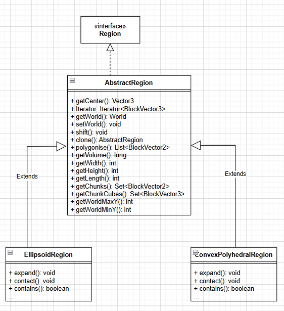
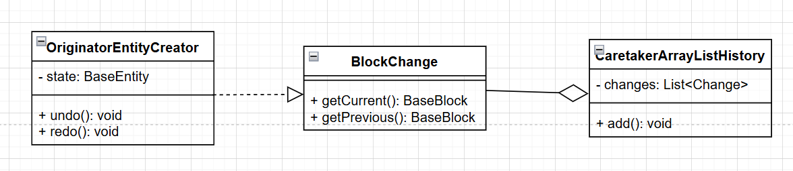
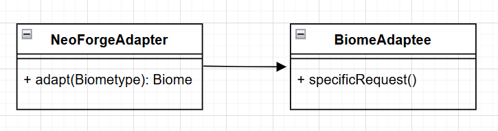

# 1) Template Method

## An illustrating code snippet.

The code snipped would include all 3 classes, the abstract one and it's sons (the chosen ones, at least). 

## A Class diagram similar to the patterns presented in class, but representing the particular instance of the pattern identified.



## The exact location on the codebase (e.g., package, class, method(s))

<br/>The classes are located in:
<br/> **Package**: shape. **Classes**: AbstractRegion, ConvexPolyhedralRegion and EllipsoidRegion.
<br/> **Path**: WorldEditPrivate\worldedit-core\src\main\java\com\sk89q\worldedit\regions\shape .

## A discussion of the rationale for identifying this as a pattern instance.

I identified the pattern based on its structure. The abstract class defines overall the structure and general operations.
The concrete regions follow that structure, changing some features and adding some as well. Each region will be preoccupied with
its own features, but it's always based on the "main structure".

# 2) Memento

## An illustrating code snippet.

````
public class ArrayListHistory implements ChangeSet {
    private final List<Change> changes = new ArrayList<>();

    ...

public class EntityCreate implements Change {

    private final Location location;
    private final BaseEntity state;
    private Entity entity;
    
    ...
    
@Override
    public void undo(UndoContext context) throws WorldEditException {
        if (entity != null) {
            entity.remove();
            entity = null;
        }
    }

    @Override
    public void redo(UndoContext context) throws WorldEditException {
        entity = checkNotNull(context.getExtent()).createEntity(location, state);
    }

    
````
## A Class diagram similar to the patterns presented in class, but representing the particular instance of the pattern identified.



## The exact location on the codebase (e.g., package, class, method(s))

<br/>The classes are located in:
<br/> **Package**: change, in history. **Classes**: BlockChange, ArrayListHistory and EntityCreate.
<br/> **Path**: WorldEditPrivate\worldedit-core\src\main\java\com\sk89q\worldedit\history\change .

## A discussion of the rationale for identifying this as a pattern instance.

I identified the pattern based on its methods and variables. This pattern often has its own state and the previous ones allowing
the user to undo actions without losing the progress. In addition, the user often can do, not only "undo", but "redo" as well.

# 3) Adapter

## An illustrating code snippet.

````
public static Biome adapt(BiomeType biomeType) {
        return ServerLifecycleHooks.getCurrentServer()
            .registryAccess()
            .registryOrThrow(Registries.BIOME)
            .getOptional(ResourceLocation.parse(biomeType.id()))
            .orElseThrow(() -> new IllegalStateException("No biome for " + biomeType.id()));
    }
````
## A Class diagram similar to the patterns presented in class, but representing the particular instance of the pattern identified.



## The exact location on the codebase (e.g., package, class, method(s))

<br/>The classes are located in:
<br/> **Package**: net.Handler, in neoforge. **Classes**: NeoForgeAdapter.
<br/> **Path**: WorldEditPrivate\worldedit-neoforge\src\main\java\com\sk89q\worldedit\neoforge\NeoForgeAdapter.java .

## A discussion of the rationale for identifying this as a pattern instance.

I identified the pattern based on its capacity to adapt two incompatible interfaces. In this case this adapter makes 
conversions so the object received is compatible with neoForge.

