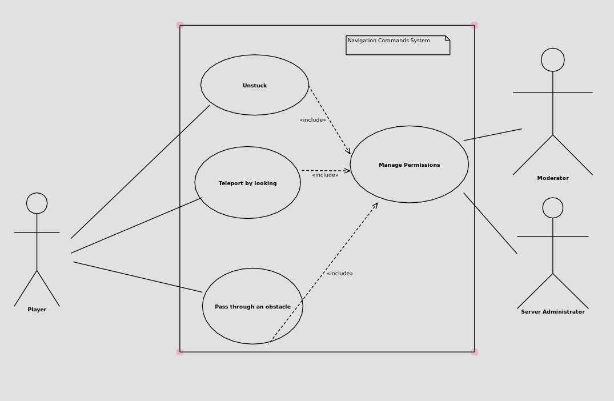
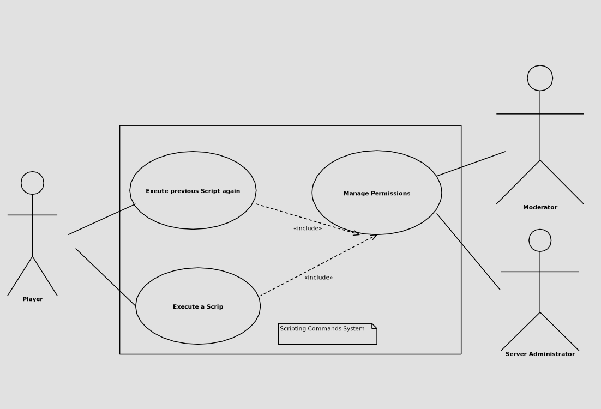

# Navigation Commands

| Use Case: Unstuck                                                                                                                                                                                                                                                                                       | 
|---------------------------------------------------------------------------------------------------------------------------------------------------------------------------------------------------------------------------------------------------------------------------------------------------------|
| **ID:** NC1                                                                                                                                                                                                                                                                                             |
| **Brief description:**   Escape from being stuck inside a block.                                                                                                                                                                                                                                    |
| **Primary Actors:**   Player                                                                                                                                                                                                                                                                        |
| **Secondary Actors:**   None.                                                                                                                                                                                                                                                                       |
| **Preconditions:**   1. The player must have WorldEdit installed.   2. The player has permission level to use WorldEdit.                                                                                                                                                                        |
| **Main flow:**   1. The use case starts when the player types the `unstuck` command in the console.   2. Include (Manage Permissions).   3. The system finds a position for the player to stand that is not inside a block.   4. The system teleports the player to the found position. |
| **Alternative flows:**   None.                                                                                                                                                                                                                                                                      |
| **Postconditions:**   1. The players is not stuck inside a block.                                                                                                                                                                                                                                   |

| Use Case: Teleport by looking                                                                                                                                                                                                                                                                                      | 
|--------------------------------------------------------------------------------------------------------------------------------------------------------------------------------------------------------------------------------------------------------------------------------------------------------------------|
| **ID:** NC2                                                                                                                                                                                                                                                                                                        |
| **Brief description:**   Teleport to the targeted block that the player is looking at.                                                                                                                                                                                                                         |
| **Primary Actors:**   Player                                                                                                                                                                                                                                                                                   |
| **Secondary Actors:**   None.                                                                                                                                                                                                                                                                                  |
| **Preconditions:**   1. The player must have WorldEdit installed.   2. The player has permission level to use WorldEdit.                                                                                                                                                                                   |
| **Main flow:**   1.The use case starts when the player types the `jumpto` command in the console.   2. Include (Manage Permissions).   3. The system identifies the position the player is looking at up to a 300 block distance.   4. The system teleports the player to the identified position. |
| **Alternative flows:**   1. The alternative flow begins after step 2. of the main flow.   2. If the player looks at the sky or a block beyond 300 blocks, the player won't teleport.                                                                                                                       |
| **Postconditions:**   1. The player is teleported to the previously targeted block position.                                                                                                                                                                                                                   |

| Use Case: Pass through an obstacle                                                                                                                                                                                                                                                       | 
|------------------------------------------------------------------------------------------------------------------------------------------------------------------------------------------------------------------------------------------------------------------------------------------|
| **ID:** NC3                                                                                                                                                                                                                                                                              |
| **Brief description:**   Teleport through blocking obstacle.                                                                                                                                                                                                                         |
| **Primary Actors:**   Player                                                                                                                                                                                                                                                         |
| **Secondary Actors:**   None.                                                                                                                                                                                                                                                        |
| **Preconditions:**   1. The player must have WorldEdit installed.   2. The player has permission level to use WorldEdit.                                                                                                                                                         |
| **Main flow:**   1. The use case starts when the player types the `thru` command in the console.   2. Include (Manage Permissions).   3.  The system identifies the position the player is looking at.   4. The system passes through the wall the player is looking at. |
| **Alternative flows:**   1. The alternative flow begins after step 2. of the main flow.   2. If where the player looks there's no free spot found beyond 6 blocks, the player won't teleport.                                                                                    |
| **Postconditions:**   1. The player teleported to the other side of the blocking obstacle.                                                                                                                                                                                           |

# Diagram

# Scripting Commands

| Use Case: Execute a Script                                                                                                                                                                                                            | 
|---------------------------------------------------------------------------------------------------------------------------------------------------------------------------------------------------------------------------------------|
| **ID:** SC1                                                                                                                                                                                                                           |
| **Brief description:**   Execute a CraftScript.                                                                                                                                                                                   |
| **Primary Actors:**   Player                                                                                                                                                                                                      |
| **Secondary Actors:**   None.                                                                                                                                                                                                     |
| **Preconditions:**   1. The player must have WorldEdit installed.   2. The player has permission level to use WorldEdit.                                                                                                      |
| **Main flow:**   1.The use case starts when the player types the `cs` command followed by needed arguments in the console.   2. Include (Manage Permissions).   3. System finds script file.   4. System runs script. |
| **Alternative flows:**   None.                                                                                                                                                                                                    |
| **Postconditions:**   1. Scrip executed.                                                                                                                                                                                          |

| Use Case: Executes previous Script again                                                                                                                                                                                               | 
|----------------------------------------------------------------------------------------------------------------------------------------------------------------------------------------------------------------------------------------|
| **ID:** SC2                                                                                                                                                                                                                            |
| **Brief description:**   Execute last CraftScript.                                                                                                                                                                                 |
| **Primary Actors:**   Player                                                                                                                                                                                                       |
| **Secondary Actors:**   None.                                                                                                                                                                                                      |
| **Preconditions:**   1. The player must have WorldEdit installed.   2. The player has permission level to use WorldEdit.   3. The player has to have run a CraftScript before.                                             |
| **Main flow:**   1. The use case starts when the player types the `.s` command followed by needed arguments in the console.   2. Include (Manage Permissions).   3. System finds script file.   4. System runs script. |
| **Alternative flows:**   None.                                                                                                                                                                                                     |
| **Postconditions:**   1. Previous script executed again.                                                                                                                                                                           |

# Diagram
