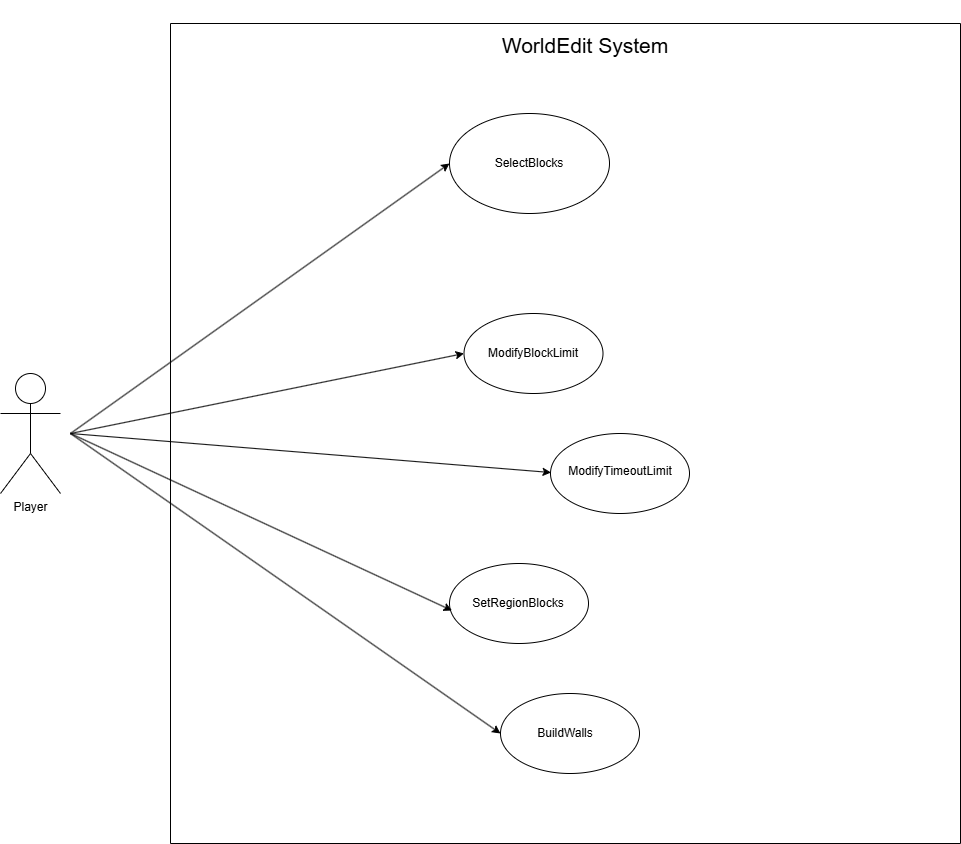

# SuperPickaxeCommands
## **Use Case**:
| Use Case: SelectBlocks                                                                                                                                       | 
|--------------------------------------------------------------------------------------------------------------------------------------------------------------|
| **ID:** SP1                                                                                                                                                  |
| **Brief description:**   Enable Area Super Pickaxe mode, which allows players to simultaneously break multiple blocks in a specified radius when mining. |
| **Primary Actors:**   Player: Executes the commands.                                                                                                     |
| **Secondary Actors:**   none                                                                                                                             |

# GeneralCommands
## **Use Case**:
| Use Case: ModifyBlockLimit                                                                                                                                            | 
|-----------------------------------------------------------------------------------------------------------------------------------------------------------------------|
| **ID:** GC1                                                                                                                                                           |
| **Brief description:**   Allows users to modify their block change limit, which controls the maximum number of blocks that can be modified in a single operation. |
| **Primary Actors:**   Player: Executes the commands.                                                                                                              |
| **Secondary Actors:**   none                                                                                                                                              |

| Use Case: ModifyTimeoutLimit                                                                                                                                |  
|-------------------------------------------------------------------------------------------------------------------------------------------------------------|
| **ID:** GC2                                                                                                                                                 |
| **Brief description:**   Enables users to modify the timeout time, which sets the maximum number of blocks that can be changed in a certain given time. |
| **Primary Actors:**   Player: Executes the commands.                                                                                                    |
| **Secondary Actors:**   none                                                                                                                                        |

# RegionCommands
## **Use Case**:
| Use Case: SetRegionBlocks                                                                                                                                             | 
|-----------------------------------------------------------------------------------------------------------------------------------------------------------------------|
| **ID:** RC1                                                                                                                                                           |
| **Brief description:**   Allows players to set all blocks within a selected region to a specified pattern, enabling quick modification of large areas.            |
| **Primary Actors:**   Player: Executes the commands.                                                                                                              |
| **Secondary Actors:**   none                                                                                                                                                  |

| Use Case: BuildWalls                                                                                                                                                  |  
|-----------------------------------------------------------------------------------------------------------------------------------------------------------------------|
| **ID:** RC2                                                                                                                                                           |
| **Brief description:**   Enables players to create walls around the perimeter of a selected region using a specified block pattern.                               |
| **Primary Actors:**   Player: Executes the commands.                                                                                                              |
| **Secondary Actors:**   none                                                                                                                                                  |

# **Use Cases Diagram**:
