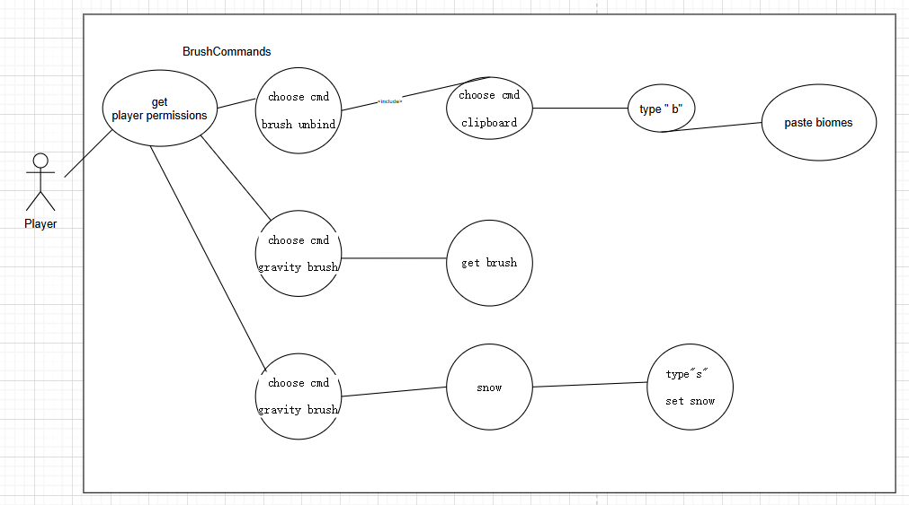

# Use Cases

# Brush commands

| Use Case: PasteBiome                                                                                                                                                                                                                                                                               | 
|----------------------------------------------------------------------------------------------------------------------------------------------------------------------------------------------------------------------------------------------------------------------------------------------------|
| **ID:** BC1                                                                                                                                                                                                                                                                                        |
| **Brief description:**   use brush to copy a biome and paste it anywhere.                                                                                                                                                                                                                      |
| **Primary Actors:**   Player                                                                                                                                                                                                                                                                   |
| **Secondary Actors:**   None.                                                                                                                                                                                                                                                                  |
| **Preconditions:**   1. The player must have WorldEdit installed.   2. The player has permission level to use WorldEdit.                                                                                                                                                                   |
| **Main flow:**   1.The use case starts when the player clicks on the command "/brush unbind" command in the console.   2.The player chooses the type of brush by the command "/clipboard" and gets the brush in the hand.  3 The player type the clipboard brush "/b" to paste biome". |
| **Alternative flows:**   None                                                                                                                                                                                                                                                                  |
| **Postconditions:**   1.There is biome available.                                                                                                                                                                                                                                              |

| Use Case: GravityBrush                                                                                                                                                                              | 
|-----------------------------------------------------------------------------------------------------------------------------------------------------------------------------------------------------|
| **ID:** BC2                                                                                                                                                                                         |
| **Brief description:**   use brush to simulate the effect of gravity.                                                                                                                           |
| **Primary Actors:**   Player                                                                                                                                                                    |
| **Secondary Actors:**   None.                                                                                                                                                                   |
| **Preconditions:**   1. The player must have WorldEdit installed.   2. The player has permission level to use WorldEdit.                                                                    |
| **Main flow:**   1.The use case starts when the player clicks on the command "/brush unbind".   2. The The player chooses the type of brush "/Gravity".   3.The player equips the brush |
| **Alternative flows:**   None.                                                                                                                                                                  |
| **Postconditions:**   1.None.                                                                                                                                                                   |

| Use Case: setSnow                                                                                                                                                                                                                        | 
|------------------------------------------------------------------------------------------------------------------------------------------------------------------------------------------------------------------------------------------|
| **ID:** BC3                                                                                                                                                                                                                              |
| **Brief description:**   sets snow in the area using brush.                                                                                                                                                                          |
| **Primary Actors:**   Player.                                                                                                                                                                                                        |
| **Secondary Actors:**   None.                                                                                                                                                                                                        |
| **Preconditions:**   1. The player must have WorldEdit installed.   2. The player has permission level to use WorldEdit.                                                                                                         |
| **Main flow:**   1.The use case starts when the player clicks on the command "/brush unbind".   2. The The player chooses the type of brush "/snow" and equips the brush.   3 The player types "/s" to set snow in the area. |
| **Alternative flows:**   None.                                                                                                                                                                                                       |
| **Postconditions:**   1.The area to aply the effect has not already stacked with snow.                                                                                                                                               |

**Use case diagram of brushcommands:**

# Selection commands

| Use Case: SetPosition                                                                                                                     | 
|-------------------------------------------------------------------------------------------------------------------------------------------|
| **ID:** SC1                                                                                                                               |
| **Brief description:**  Set position for the actor                                                                                    |
| **Primary Actors:**   Actor                                                                                                           |
| **Secondary Actors:**   None                                                                                                          |
| **Preconditions:**   1. The actor must be Locatable.                                                                                  |
| **Main flow:**   1.The use case starts when the system detects the command "/pos".   2. The system sets the position of the actor. |
| **Alternative flows:**   None                                                                                                         |
| **Postconditions:**   1.The positions 1 and 2 is not null.                                                                            |

| Use Case: SetPos1ToTargetBlock                                                                                                                                                                  | 
|-------------------------------------------------------------------------------------------------------------------------------------------------------------------------------------------------|
| **ID:** SC2                                                                                                                                                                                     |
| **Brief description:**   Set position 1 to targeted block                                                                                                                                   |
| **Primary Actors:**   Player                                                                                                                                                                |
| **Secondary Actors:**   None                                                                                                                                                                |
| **Preconditions:**  2. The player must have WorldEdit installed.   3. The player has permission level to use WorldEdit.                                                                 |
| **Main flow:**   1.The use case starts when the player clicks the command "/hpos1".  2.The system detects the location of the player.  3. The system drags the block to the player. |
| **Alternative flows:**   None                                                                                                                                                               |
| **Postconditions:**   1. The block exists.  2.The block is not with the Player.                                                                                                         |
