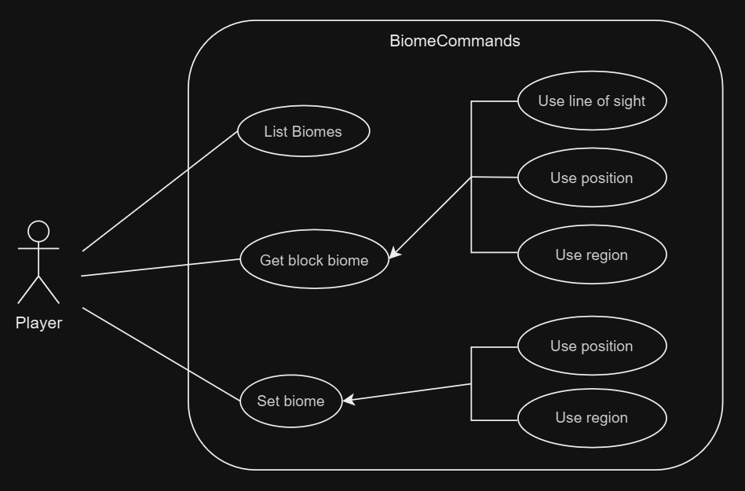
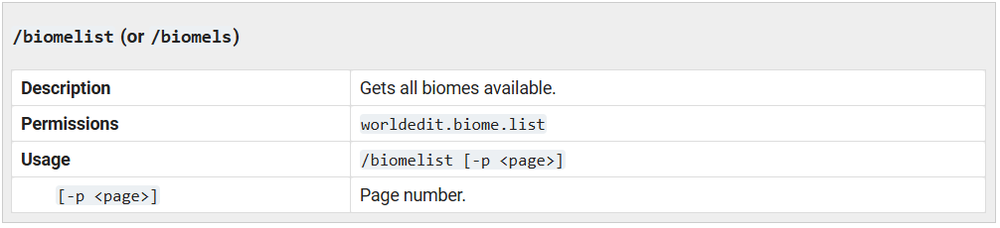
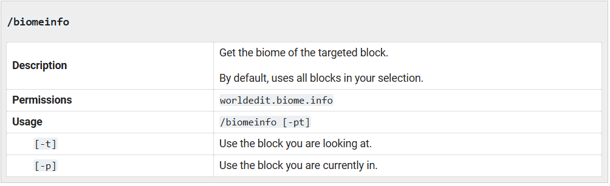
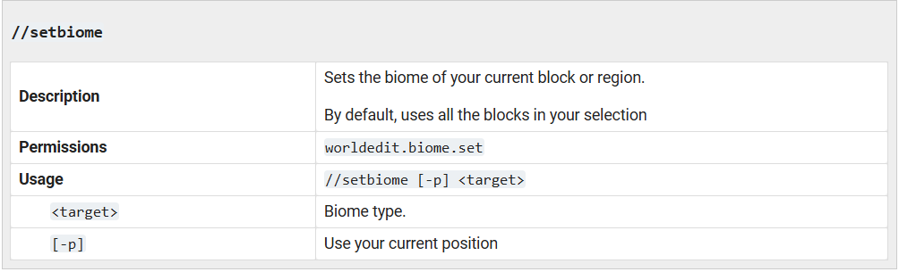
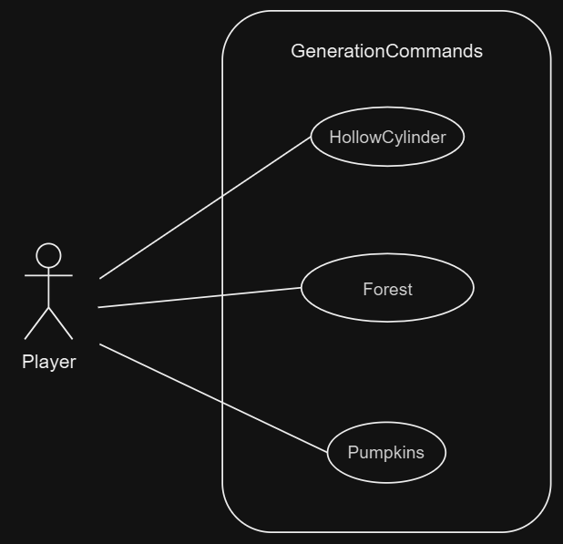
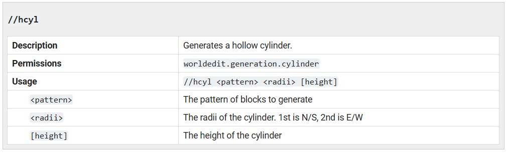
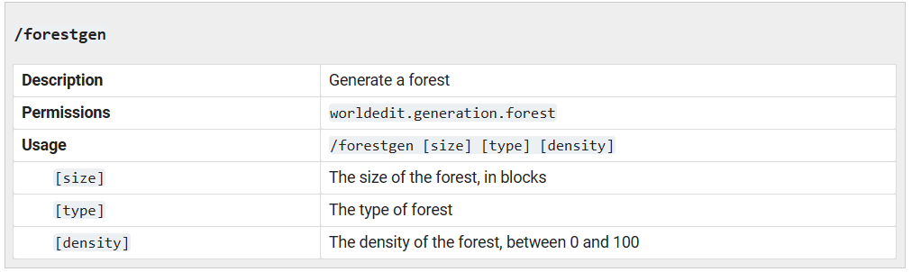
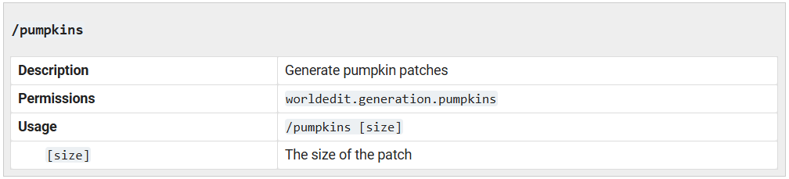

# Biome Commands

**In** `worldedit-core/src/main/java/com/sk89q/worldedit/command/BiomeCommands.java`

- **biomelist**: List all biomes
- **biomeinfo**:Get the biome of a specific location
- **setbiome**: Set the biome of a current block or region

## Brief description of each use case

| Use Case: ListBiomes (biomelist)                           |
|------------------------------------------------------------| 
| **ID:** BC1                                                |
| **Brief description:**   Gets all the biomes available.|
| **Primary Actors:**   Player: Executes the command.    |
| **Secondary Actors:**   None                           |

| Use case: GetBiome (biomeinfo)                                                                                                                                                                                                                          |
|---------------------------------------------------------------------------------------------------------------------------------------------------------------------------------------------------------------------------------------------------------|
| **ID:** BC2                                                                                                                                                                                                                                             |
| **Brief description:**   Gets the biome of a specific location.   The information obtained from the biome depends on how it is requested: whether by the player's position, in the player's line of sight or in a block selected by the player. 
| **Primary Actors:**   Player: Executes the command.                                                                                                                                                                                                 |
| **Secondary Actors:**   None                                                                                                                                                                                                                        |

| Use Case: SetBiome (setbiome)                               |
|-------------------------------------------------------------| 
| **ID:** BC3                                                 |
| **Brief description:**   Sets the biome of a current block or region.   The region to change the biome depends on the requested one, whether the player's position or a region selected by the player.
| **Primary Actors:**   Player: Executes the command.     |
| **Secondary Actors:**   None                            |

## Use Case Diagram

###  **From** https://worldedit.enginehub.org/

# Generation Commands

**In** `worldedit-core/src/main/java/com/sk89q/worldedit/command/BiomeCommands.java`

Por forma a facilitar o desenho do use case diagram e a sua compreensão,
foram apenas selecionados 3 comandos de `GenerationCommands`:

- **hcyl**: Generates a hollow cylinder.
- **forestgen**: Generate a forest
- **pumpkins**: Generate pumpkin patches.

## Brief description of each use case

| Use Case: HollowCylinder (hcyl)                                  |
|------------------------------------------------------------------| 
| **ID:** GC1                                                      |
| **Brief description:**   Generates a hollow cylinder.   To draw the cylinder, the player specifies which pattern of block to generate (`<pattern>`), which is the radii of th cylinder (`<radii>`) and which is the height of the cylinder (`[height]`).
|
| **Primary Actors:**   Player: Executes the command.          |
| **Secondary Actors:**   None                                 |

| Use case: Forest (forestgen)                            |
|---------------------------------------------------------|
| **ID:** GC2                                             |
| **Brief description:**   Generates a forest.   To draw the forest, the player must specify the size of the forest in blocks (`[size]`), the type of the forest (`[type]`) and its density, between 0 and 100 (`[density] `).
|
| **Primary Actors:**   Player: Executes the command. |
| **Secondary Actors:**   None                        |

| Use Case: Pumpkins (pumpkins)                                                                                                                                                                                  |
|----------------------------------------------------------------------------------------------------------------------------------------------------------------------------------------------------------------| 
| **ID:** GC3                                                                                                                                                                                                    |
| **Brief description:**   Generates pumpkin patches.   To draw the pumpkin patches, the player must specify the saize of the patches (`[size]`).
| **Primary Actors:**   Player: Executes the command.                                                                                                                                                        |
| **Secondary Actors:**   None                                                                                                                                                                               |

## Use Case Diagram

###  **From** https://worldedit.enginehub.org/

