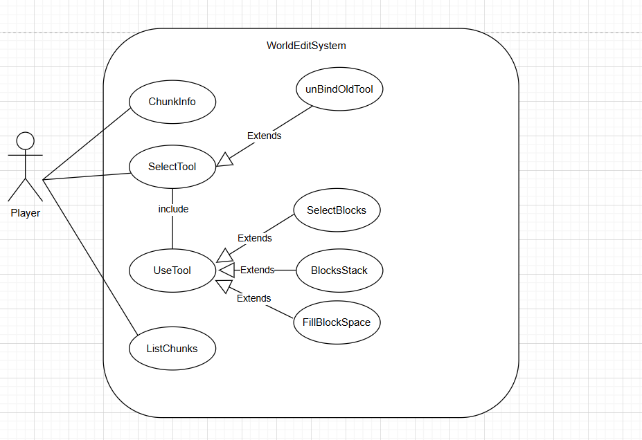
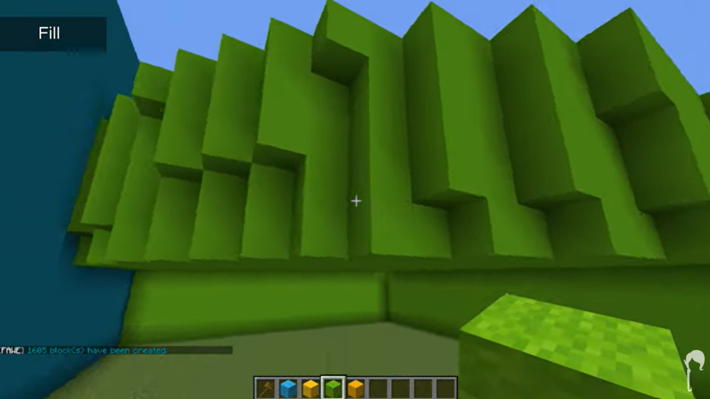
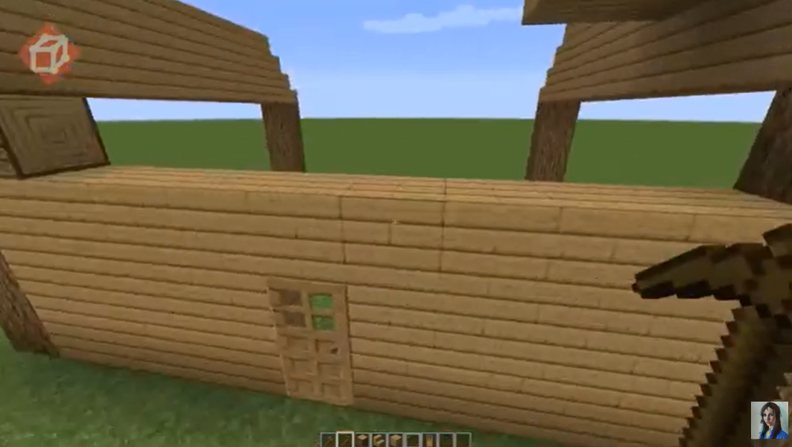
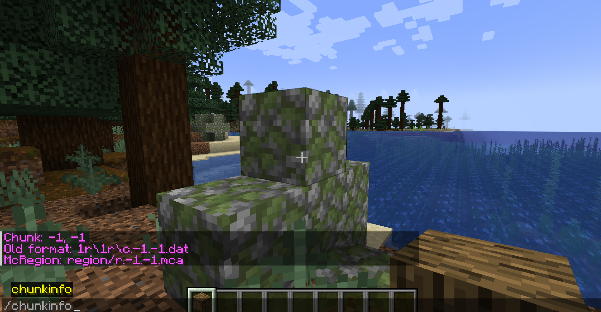
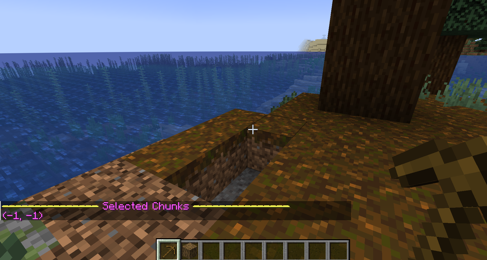
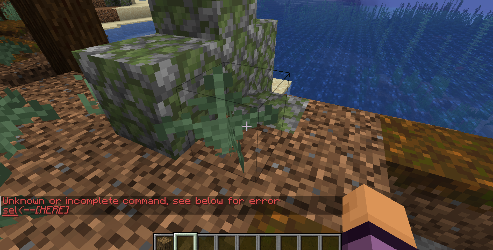
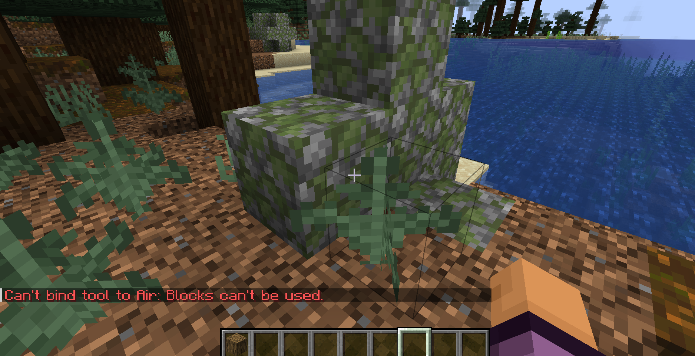
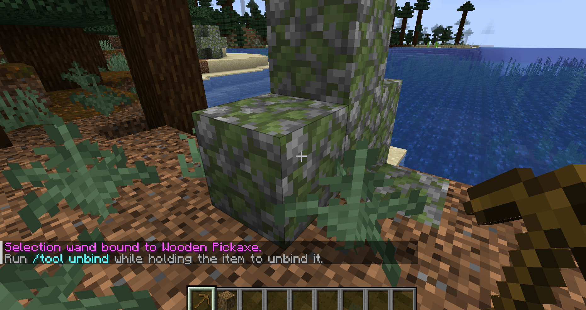

# Tool Commands

## **Use Cases Diagram**:

## **Use Cases**:

| Use Case: SelectBlocks                                                                                                                                                                                                                                                                    | 
|-------------------------------------------------------------------------------------------------------------------------------------------------------------------------------------------------------------------------------------------------------------------------------------------|
| **ID:** TC1                                                                                                                                                                                                                                                                               |
| **Brief description:**   Select blocks with the tool and use them.                                                                                                                                                                                                                    |
| **Primary Actors:**   Player: Executes the commands.                                                                                                                                                                                                                                  |
| **Secondary Actors:**   None.                                                                                                                                                                                                                                                         |
| **Preconditions:**   1. The player must have WorldEdit installed.   2. The player has permission level to use WorldEdit.   3. The player either has no tool or has to unbind the old one.   4. The player must be holding an item.                                        |
| **Main flow:**   1.The use case starts when the player types the `/tool selwand` command in the console.   2. The player's current item's functionality changes into a selection tool.   3. The player has now the power to select a set of blocks and use them as he wishes. |
| **Alternative flows:**   None.                                                                                                                                                                                                                                                        |
| **Postconditions:**   None.                                                                                                                                                                                                                                                           |

## **Illustration**:
It can be selected and then copied, for example. It should show something like this:

| Use Case: FillBlocks                                                                                                                                                                                                                                                                                   | 
|--------------------------------------------------------------------------------------------------------------------------------------------------------------------------------------------------------------------------------------------------------------------------------------------------------|
| **ID:** NC2                                                                                                                                                                                                                                                                                            |
| **Brief description:**   Fill a defined space with blocks of a certain type.                                                                                                                                                                                                                       |
| **Primary Actors:**   Player: Executes the commands.                                                                                                                                                                                                                                               |
| **Secondary Actors:**   None.                                                                                                                                                                                                                                                                      |
| **Preconditions:**   1. The player must have WorldEdit installed.   2. The player has permission level to use WorldEdit.   3. The player either has no tool or has to unbind the old one.   4. The player must be holding an item.                                                     |
| **Main flow:**   1.The use case starts when the player types the `/floodfill` command in the console.   2. The player's current item's functionality changes into a flood fill tool.   3. The player has now the power to create a set of blocks within a range established by the player. |
| **Alternative flows:**   Instead of stopping creating blocks when the limit is reached, it could keep creating in a different direction until it's told to stop.                                                                                                                                   |
| **Postconditions:**   None.                                                                                                                                                                                                                                                                        |

## **Illustration**: 
It was created a whole amount of blocks, created in every direction.

| Use Case: StackOfBlocks                                                                                                                                                                                                                                                                         | 
|-------------------------------------------------------------------------------------------------------------------------------------------------------------------------------------------------------------------------------------------------------------------------------------------------|
| **ID:** NC3                                                                                                                                                                                                                                                                                     |
| **Brief description:**   Add a whole stack of blocks in a selected region.                                                                                                                                                                                                                  |
| **Primary Actors:**   Player: Executes the commands.                                                                                                                                                                                                                                        |
| **Secondary Actors:**   None.                                                                                                                                                                                                                                                               |
| **Preconditions:**   1. The player must have WorldEdit installed.   2. The player has permission level to use WorldEdit.   3. The player either has no tool or has to unbind the old one.   4. The player must be holding an item.                                              |
| **Main flow:**   1.The use case starts when the player types the `/stacker` command in the console.   2. The player's current item's functionality changes into a stacker tool.   3. The player has now the power to create a line of blocks with a size established by the player. |                                              |
| **Alternative flows:**   None.                                                                                                                                                                                                                                                              |
| **Postconditions:**   None.                                                                                                                                                                                                                                                                 |

## **Illustration**:
It can be useful when building a house, for example.

# Chunk Commands

| Use Case: ChunkData                                                                                                                                                        | 
|----------------------------------------------------------------------------------------------------------------------------------------------------------------------------|
| **ID:** CC1                                                                                                                                                                |
| **Brief description:**   Inform the player about chunk data.                                                                                                           |
| **Primary Actors:**   Player: Executes the commands.                                                                                                                   |
| **Secondary Actors:**   None.                                                                                                                                          |
| **Preconditions:**   1. The player must have WorldEdit installed.   2. The player has permission level to use WorldEdit.                                           |
| **Main flow:**   1.The use case starts when the player types the `/chunkinfo` command in the console.   2. The chunk's information's are calculated and displayed. |                                              
| **Alternative flows:**   None.                                                                                                                                         |
| **Postconditions:**   None.                                                                                                                                            |

## **Illustration**:
It should show something like this:

| Use Case: ListOfChunks                                                                                                                                                          | 
|---------------------------------------------------------------------------------------------------------------------------------------------------------------------------------|
| **ID:** CC2                                                                                                                                                                     |
| **Brief description:**   List selected chunks.                                                                                                                              |
| **Primary Actors:**   Player: Executes the commands.                                                                                                                        |
| **Secondary Actors:**   None.                                                                                                                                               |
| **Preconditions:**   1. The player must have WorldEdit installed.   2. The player must have selected chunks.   3. The player has permission level to use WorldEdit. |
| **Main flow:**   1.The use case starts when the player types the `/listchunks` command in the console.   2. The chunks are listed.                                      |                                              
| **Alternative flows:**   None.                                                                                                                                              |
| **Postconditions:**   None.                                                                                                                                                 |

## **Illustration**:
It should show something like this:

# Errors/success examples of the first use case: 

## When the arguments are less than the expected:

## When the player tries to bind a tool and does not have an item:

## In case of success:

