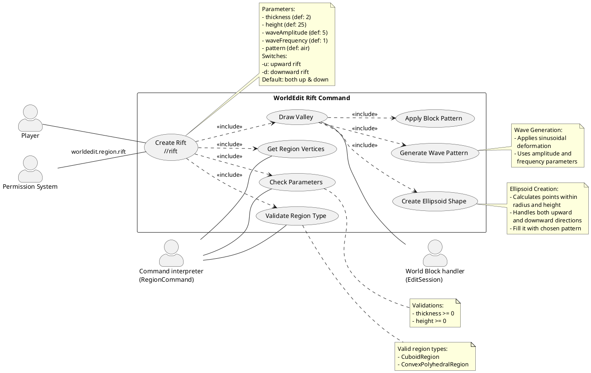

# Rit command use case diagram

| Use case 1: WorldEdit Rift Creation                                                                                                                                                                                                                                                                                                                                                                                                                                                                                                                                       |
| ------------------------------------------------------------------------------------------------------------------------------------------------------------------------------------------------------------------------------------------------------------------------------------------------------------------------------------------------------------------------------------------------------------------------------------------------------------------------------------------------------------------------------------------------------------------------- |
| **ID:** RIFT-001                                                                                                                                                                                                                                                                                                                                                                                                                                                                                                                                                          |
| **Brief description:** Player creates a rift in the terrain using the /rift command with various parameters                                                                                                                                                                                                                                                                                                                                                                                                                                                               |
| **Primary actor:** Player                                                                                                                                                                                                                                                                                                                                                                                                                                                                                                                                                 |
| **Secondary actor(s):** Permission System, Command interpreter (RegionCommand), World Block handler (EditSession)                                                                                                                                                                                                                                                                                                                                                                                                                                                         |
| **Preconditions:** 1. WorldEdit must be installed 2. Player must have selected a valid region (CuboidRegion or ConvexPolyhedralRegion) 3. Player must have the worldedit.region.rift permission                                                                                                                                                                                                                                                                                                                                                                  |
| **Main flow:** 1. Player executes //rift command with desired parameters 2. Permission System validates player's permission 3. Command interpreter validates region type 4. Command interpreter checks parameter validity (thickness >= 0, height >= 0) 5. Command interpreter gets region vertices 6. EditSession generates wave pattern based on amplitude and frequency 7. EditSession creates ellipsoid shape for the rift 8. EditSession applies block pattern to create the rift 9. System confirms rift creation with block change count |
| **Alternative flows:** 2a. If permission check fails: Show error message and terminate 3a. If invalid region type: Show region type requirements and terminate 4a. If invalid parameters: Show parameter constraints and terminate 5a. If region vertices cannot be determined: Show error and terminate                                                                                                                                                                                                                                                      |
| **Postconditions:** 1. A rift is created in the selected region according to specified parameters 2. The world is updated with the new rift formation 3. Player receives confirmation of the operation with block change count                                                                                                                                                                                                                                                                                                                                   |
